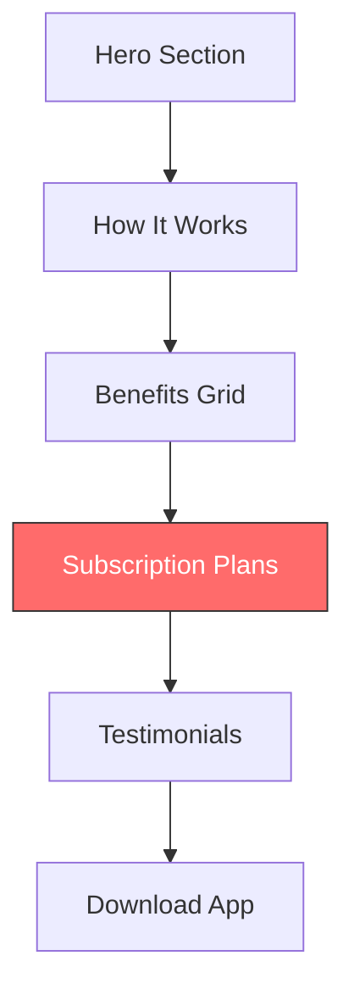

# Drive Page Subscription Section - Implementation Plan

## Executive Summary

This plan outlines the strategy for adding a subscription section to the Drive page featuring a **$19.99/month** pricing with **0% commission** model for ALL drivers. The key "catch" is a **daily minimum ride requirement** that drivers must meet to maintain the discounted rate.

**Core Positioning**: Spinr is a TRUE 0% commission app - every driver keeps 100% of their fare. The subscription fee covers platform access, not commission.

---

## 1. Industry Analysis & Recommendations

### Average Rideshare Driver Statistics

| Driver Type | Weekly Trips | Daily Average | Monthly Trips |
|-------------|--------------|---------------|---------------|
| Part-time (side hustle) | 10-20 | 1.5-3 | 40-80 |
| Full-time | 30-50 | 4-7 | 120-200 |
| High-performing | 50-70 | 7-10 | 200-280 |

### Recommended Daily Minimum: **5 rides/day**

**Rationale:**
- Aligns with full-time driver activity (realistic for serious drivers)
- Allows ~150 trips/month which generates ~$2,700 in revenue (at $18 avg fare)
- Drivers save ~$675/month vs 25% commission competitors
- $19.99 subscription represents only 0.7% of monthly earnings

---

## 2. The "Catch" - Subscription Conditions

### Recommended Structure

```mermaid
graph LR
    A[$19.99/mo Subscription] --> B{Met Daily Minimum?}
    B -->|Yes| C[0% Commission<br/>Keep 100% of Fares]
    B -->|No| D[Small Per-Trip Fee<br/>($0.50/ride)]
    
    style A fill:#ff6b6b,stroke:#333
    style C fill:#51cf66,stroke:#333
    style D fill:#fcc419,stroke:#333
```

**All drivers get 0% commission - the difference is the subscription fee unlocks the best rates.**

### Specific Conditions to Implement

| Condition | Recommendation | Purpose |
|-----------|----------------|---------|
| **Daily Minimum** | 5 rides/day | Ensures platform activity |
| **Monthly Threshold** | 150 rides/month | 5 rides × 30 days |
| **Grace Period** | Miss 2 days max/month | Flexibility for drivers |
| **Fallback Option** | $0.50 per trip if below minimum | Avoid losing drivers entirely |
| **Tiered激励** | 200+ trips = discount on subscription | Reward high performers |

---

## 3. Value Proposition - The Math

### Driver Savings Calculator

| Metric | Competitors (25% commission) | Spinr ($19.99/mo) |
|--------|------------------------------|-------------------|
| Avg fare | $18.00 | $18.00 |
| Commission (25%) | $4.50 | $0.00 |
| Platform fee | $0.00 | $0.66 (÷25 rides/day) |
| Driver keeps | $13.50 | $17.34 |
| **Extra per ride** | - | **$3.84** |
| **Monthly extra (150 rides)** | - | **$576/month** |

### Break-even Analysis

- Driver needs to complete **Just 1.1 rides per day** to cover $19.99 subscription
- At 5 rides/day minimum: saves $576/month vs competitors

---

## 4. UI/UX Design Recommendations

### Section Placement



**Recommendation**: Update existing Subscription Plans section (currently lines 308-406)

### Key Messaging - ALL DRIVERS GET 0% COMMISSION

1. **Headline**: "0% Commission - That's Our Promise"
2. **Sub-headline**: "Every driver keeps 100% of their fare. The $19.99/month covers platform access, not commissions."
3. **The "Catch"**: "Just stay active on the road - complete 5 rides/day to maintain your rate"

---

## 5. Simplified Plan Structure (0% Commission for ALL)

### Plan A: Active Driver ($19.99/month)
- ✅ **0% commission on ALL fares** - keep every dollar
- ⚠️ 5 rides/day minimum requirement
- 📅 Weekly payouts
- 📞 Basic driver support (business hours)
- 📱 Standard app features

### Plan B: Pro Driver ($0 for 6 months, then $29.99/month)
- ✅ **0% commission on ALL fares** - keep every dollar
- ✅ No minimum requirement (premium benefit)
- ⚡ Instant daily payouts
- 🎯 24/7 priority support
- 📊 Advanced app features (heatmaps, tips optimization, priority rides)

**Key Message**: ALL drivers get 0% commission - the subscription is about unlocking premium features and flexibility, NOT about different commission rates.

---

## 6. Marketing Positioning

| What We Say | What It Means |
|-------------|---------------|
| "0% Commission" | Every driver keeps 100% of their fare |
| "$19.99/month subscription" | Access to platform + premium features |
| "5 rides/day minimum" | Stay active to maintain best rate |
| "Try 6 months free" | Test the Pro plan with no commitment |

---

## 7. Implementation Steps

### Phase 1: Update Existing Subscription Section

- [ ] Replace $0 pricing with actual $19.99/month
- [ ] Add daily minimum requirement display
- [ ] Create savings calculator component
- [ ] Update plan names (e.g., "Active Driver" vs "Pro Driver")
- [ ] Emphasize "0% Commission for ALL Drivers"

### Phase 2: Add New UI Components

- [ ] Add "How It Works" 3-step visual for subscription
- [ ] Create comparison chart vs competitors (25% commission)
- [ ] Add FAQ accordion for subscription questions
- [ ] Implement "Sticky" subscription CTA in header
- [ ] Add savings calculator (input: trips/day, output: savings)

### Phase 3: Trust & Transparency

- [ ] Add "What happens if I miss the minimum" tooltip
- [ ] Create "Subscription Calculator" interactive element
- [ ] Add testimonials from drivers who've saved money
- [ ] Highlight: "We don't take any commission - ever"

---

## 8. Acceptance Criteria

1. ✅ Subscription section clearly shows $19.99/month pricing
2. ✅ Daily minimum of 5 rides is prominently displayed
3. ✅ **ALL drivers get 0% commission** (key differentiator)
4. ✅ Value proposition (savings vs competitors) is calculable
5. ✅ "Catch" is transparent - no hidden fees or surprises
6. ✅ Break-even point is highlighted (just 1-2 rides/day)
7. ✅ Pro plan offers no-minimum option for flexibility
8. ✅ Mobile-responsive design
9. ✅ Clear CTA buttons for each plan
10. ✅ No tiered commission rates (true 0% for everyone)

---

## 9. Next Steps

1. **Approve this plan** - Confirm daily minimum of 5 rides
2. **Switch to Code Mode** - Implement the subscription section updates
3. **Create calculator component** - Interactive savings display
4. **Add FAQ content** - Common questions about the subscription
5. **A/B test headlines** - Optimize conversion rates

---

*Plan created: February 2026*
*For: Spinr Drive Page Update*
*Updated: Simplified to true 0% commission model*
